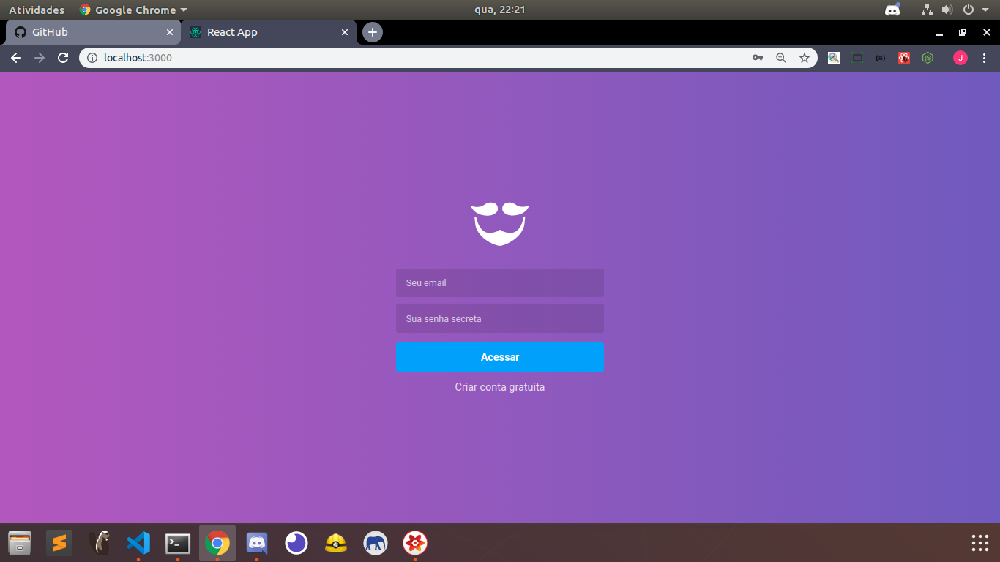
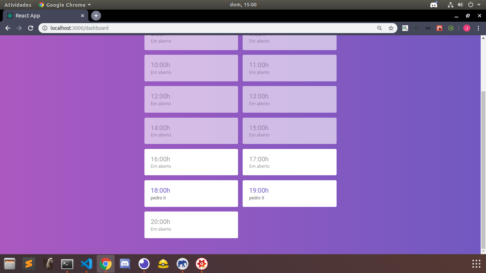
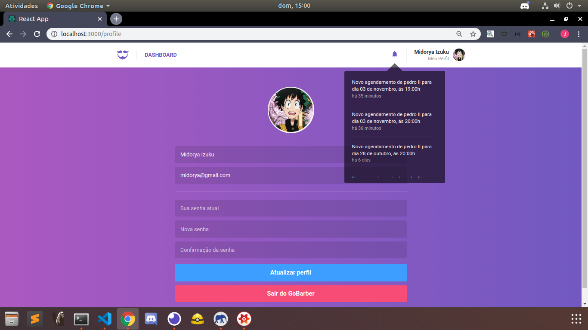
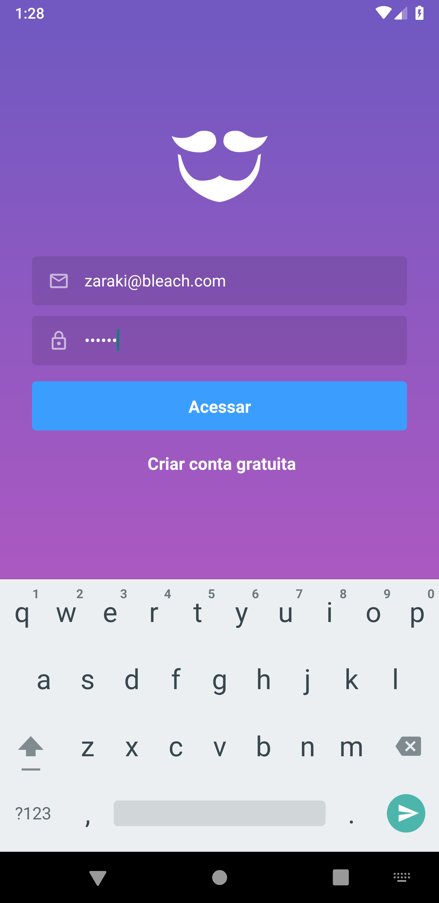

<h1>GoBarber</h1>

<i>Instructions</i>
<ul>
  <li>First step: inside api's folder, run : "Docker-compose up"  to create containers</li>
  <li>Second step: inside api's folder,  run: " yarn sequelize db:migrate" to create the table in your database</li>
  <li>Third step: inside api's folder run: " yarn dev " to start the back-end</li>
  <li>Fourth step: inside web folder, run "yarn start" to start the front-end</li>
  <li> You can also use NPM</li>
</ul>
<h3>Backend</h3>

It's an api rest using the following DBs:  
PostgreSQL, MongoDB and Redis. 
 ORM: Sequelize and Mongoose. 

<a href="https://github.com/jonathanwdev/GoBarber/tree/master/api">Read more</a> 
  

    
  

 

 <h3>I worked with ReactJS, Redux and Redux-Saga</h3>
 
A Single page application

 <a href="https://github.com/jonathanwdev/GoBarber/tree/master/web">Read more</a> 
 

  
  
  
  
  
  
 

 

<h3>I worked with ReactNative</h3>
<a href="https://github.com/jonathanwdev/GoBarber/tree/master/mobile">Read more</a> 

 

  
  
 
 

