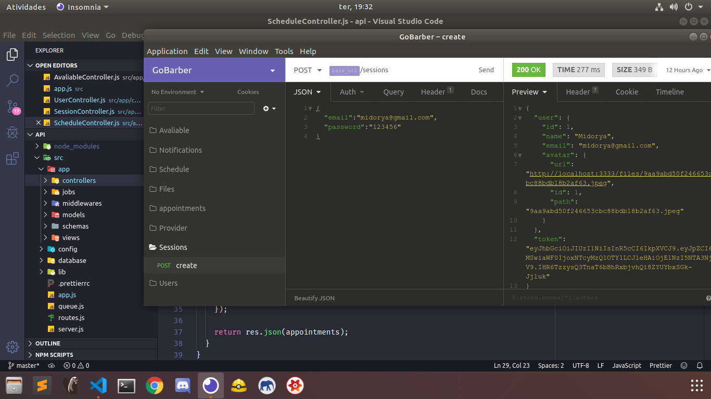

<h1>GoBarber</h1>
<h3>Backend</h3>

A rest full api to manage a barbershop. [Read more](GoBarber/tree/master/api.md)
 
  

    
  

 

 <h3>I'm working on it with React.JS+Redux</h3>
 
Development......

 

<h3>I'll work with reactNative</h3>

soon

