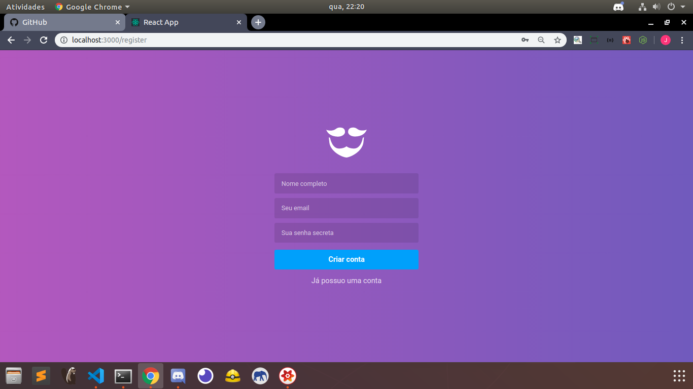
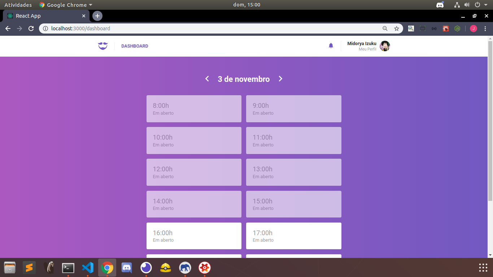

<h1>GoBarber Web</h1>
<h3> The goBarber Web is the provider's version, here he can recieve notifications, he can manage his schedule and check who made an appointment and when has an appointment.</h3>

  
  
  
  
  
  

<h3>Tecnologies</h3>
<ul>
  <li>ReactJS: To build a Single page application </li>
  <li>Redux - Redux-Saga: for application state management. </li>
  <li>RocketSeat/unform: Work with forms and components</li>
  <li>React Toastify:  show alerts</li>
  <li>Styled Components: to work with css in a different way</li>
  <li>Polished: to work with colors</li>
  <li>React Icons: to use icons packages</li>
</ul>
